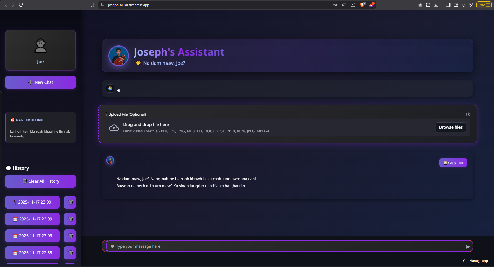

# 🤖 Joseph's Assistant - LAI HOLH AI

An advanced AI chatbot that communicates in Lai language (Hakha dialect) with a beautiful, modern, and responsive user interface.


## ✨ Features

- 🗣️ **Lai Language Support**: Native communication in Lai (Hakha dialect)
- 💬 **Intelligent Conversations**: Powered by Google's Gemini AI
- 🎨 **Modern UI**: Beautiful gradient design with smooth animations
- 📱 **Fully Responsive**: Works seamlessly on desktop, tablet, and mobile
- 💾 **Chat History**: Save and manage multiple conversation sessions
- 📋 **Copy Functionality**: Easily copy AI responses
- 📁 **File Upload**: Support for PDF, images, documents, and more
- 👥 **User Authentication**: Secure login and registration system
- 🎯 **Admin Dashboard**: User management (for admins)
- 🌙 **Dark Theme**: Eye-friendly dark mode design

## 🚀 Demo



## 📋 Prerequisites

- Python 3.8 or higher
- Google Gemini API Key
- Modern web browser

## 🛠️ Installation

1. **Clone the repository**
   ```bash
   git clone https://github.com/Joseph1997-eng/Joseph-AI.git
   cd Joseph-AI
   ```

2. **Install dependencies**
   ```bash
   pip install -r requirements.txt
   ```

3. **Set up environment variables**

   Create a `.streamlit/secrets.toml` file:
   ```toml
   GEMINI_API_KEY = "your-api-key-here"
   ```

   Or set as environment variable:
   ```bash
   export GEMINI_API_KEY="your-api-key-here"
   ```

4. **Run the application**
   ```bash
   streamlit run app.py
   ```

5. **Open your browser**
   ```
   http://localhost:8501
   ```

## 📁 Project Structure

```
joseph-ai/
├── app.py                 # Main application file
├── style.css             # Custom styling and animations
├── system_prompt.txt     # AI personality configuration
├── requirements.txt      # Python dependencies
├── .gitignore           # Git ignore file
├── README.md            # Project documentation
└── .streamlit/
    └── secrets.toml     # API keys (not in git)
```

## 🔧 Configuration

### API Key Setup

Get your Gemini API key from [Google AI Studio](https://makersuite.google.com/app/apikey)

### System Prompt

Customize the AI's personality by editing `system_prompt.txt`

### Styling

Modify `style.css` to change colors, animations, and layout

## 📦 Dependencies

```
streamlit>=1.28.0
google-generativeai>=0.3.0
```

## 🎯 Usage

### For Users

1. **Register**: Create an account with username and password
2. **Login**: Sign in with your credentials
3. **Chat**: Start conversing in Lai language
4. **Upload Files**: Share documents, images, or other files
5. **History**: Access previous conversations from sidebar
6. **Copy**: Use copy button to save AI responses

### For Admins

- Username: `Joe` (or change in code)
- Access admin panel from sidebar
- View total users and user list

## 🎨 Features in Detail

### Chat Interface
- Animated message bubbles
- Smooth fade-in animations
- Copy button for each AI response
- Text wrapping and formatting

### User Profile
- Animated avatar
- Session management
- Chat history with timestamps
- One-click history deletion

### File Upload
- Support for multiple file types
- Drag and drop interface
- Visual feedback

## 🔒 Security

- Passwords are hashed using SHA-256
- API keys stored in environment variables
- SQL injection protection
- Secure session management

## 🌐 Deployment

### Streamlit Cloud

1. Push code to GitHub
2. Connect to [Streamlit Cloud](https://streamlit.io/cloud)
3. Add secrets in dashboard
4. Deploy!

### Docker

```dockerfile
FROM python:3.9-slim
WORKDIR /app
COPY . .
RUN pip install -r requirements.txt
EXPOSE 8501
CMD ["streamlit", "run", "app.py"]
```

## 🤝 Contributing

Contributions are welcome! Please feel free to submit a Pull Request.

1. Fork the project
2. Create your feature branch (`git checkout -b feature/AmazingFeature`)
3. Commit your changes (`git commit -m 'Add some AmazingFeature'`)
4. Push to the branch (`git push origin feature/AmazingFeature`)
5. Open a Pull Request

## 📝 License

This project is licensed under the MIT License - see the [LICENSE](LICENSE) file for details.

## 👨‍💻 Author

**Joseph**

- GitHub: [@Joseph1997-eng](https://github.com/Joseph1997-eng)
- Email: josephsaimonn@gmail.com

## 🙏 Acknowledgments

- Google Gemini AI for the language model
- Streamlit for the amazing framework
- The Lai community for language support

## 📞 Support

If you encounter any issues or have questions:

- 📧 Email: josephsaimonn@gmail.com
- 🐛 Issues: [GitHub Issues](https://github.com/Joseph1997-eng/Joseph-AI/issues)

## 🔮 Future Enhancements

- [ ] Voice input/output
- [ ] Multi-language support
- [ ] Advanced admin analytics
- [ ] Export chat history
- [ ] Dark/Light theme toggle
- [ ] Mobile app version
- [ ] API integration
- [ ] Feedback system

## 📊 Stats


---

**Made with ❤️ for the Lai community**
